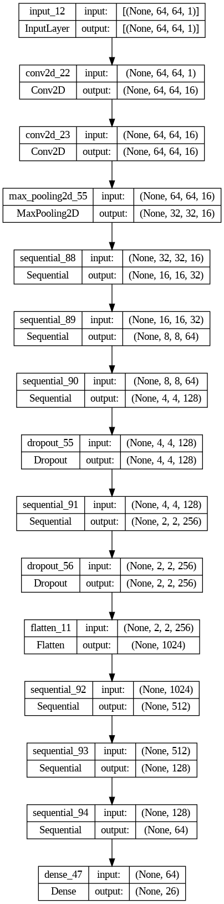

# Hand Gesture Recognition for Sign Language

This project aims to develop an artificial intelligence (AI) model capable of recognizing hand gestures in sign language and translating them into text. The primary objective is to create a tool that enhances communication and interaction for individuals who use sign language as their primary means of communication.

## Key Objectives:
<li>Gesture Recognition: Train a deep learning model to accurately recognize and classify hand gestures commonly used in sign language.</li>
<li>Real-time Translation: Develop the capability to translate recognized gestures into text instantaneously, enabling seamless communication.</li>
<li>User Interface: Create a user-friendly interface that allows users to interact with the system easily, providing both input via gestures and output via text.</li>

## Machine Learning ands Deep Learning Frameworks used:
<li>Tensorflow</li>
<li>Scikit-learn</li>
<li>Numpy,Pandas</li>
<li>Plotly</li>

# Model Architecture

Our model utilizes convolutional layers for feature extraction from hand gesture images, followed by MaxPooling to downsample and preserve key features. Dense layers integrate learned features for gesture classification, enhanced by dropout regularization to prevent overfitting. The final layer employs a sigmoid activation function for multi-label classification, enabling accurate recognition of diverse sign language gestures in real-time applications.

### Optimizers Used:
- RMSprop
- Adam
- Adadelta
- Adagrad

### Results:

| Epochs | Optimizer | Activation Function | Train Loss | Train Accuracy | Train Precision | Train Recall | Val Loss | Val Accuracy | Val Precision | Val Recall |
|--------|-----------|---------------------|------------|----------------|-----------------|--------------|----------|--------------|---------------|------------|
| 8      | 9         | Adadelta            | relu       | 4.202672       | 0.031692        | 0.038538        | 0.500214   | 3.374346     | 0.037962      | 0.040084   | 0.569431   |
| 7      | 8         | Adam                | relu       | 3.311365       | 0.051820        | 0.042833        | 0.553319   | 3.246309     | 0.053946      | 0.042254   | 0.533467   |
| 0      | 1         | Adadelta            | relu       | 4.181376       | 0.043255        | 0.037815        | 0.494218   | 3.331768     | 0.041958      | 0.038890   | 0.544456   |
| 6      | 7         | Adam                | relu       | 3.326572       | 0.050964        | 0.042110        | 0.537473   | 3.272782     | 0.035964      | 0.040731   | 0.503497   |
| 8      | 9         | RMSprop             | relu       | 3.244080       | 0.067666        | 0.041408        | 0.610707   | 3.199470     | 0.072927      | 0.039833   | 0.677323   |

### Activation Functions Tested:
- relu
- sigmoid
- softmax
- tanh
- softsign
- selu
- elu

### Results for RMSprop Optimizer:

| Epochs | Optimizer | Activation Function | Train Loss | Train Accuracy | Train Precision | Train Recall | Val Loss | Val Accuracy | Val Precision | Val Recall |
|--------|-----------|---------------------|------------|----------------|-----------------|--------------|----------|--------------|---------------|------------|
| 9      | 10        | RMSprop             | softsign   | 3.262897       | 0.044968        | 0.039963        | 0.589722   | 3.475484     | 0.040959      | 0.023810   | 0.001998   |
| 9      | 10        | RMSprop             | sigmoid    | 3.240383       | 0.060814        | 0.041611        | 0.605567   | 5.251967     | 0.035964      | 0.033548   | 0.025974   |
| 5      | 6         | RMSprop             | selu       | 3.370477       | 0.039400        | 0.040016        | 0.555889   | 3.253613     | 0.048951      | 0.039661   | 0.892108   |
| 0      | 1         | RMSprop             | softmax    | 3.959502       | 0.044111        | 0.038332        | 0.496788   | 3.314115     | 0.043956      | 0.040493   | 0.607393   |
| 8      | 9         | RMSprop             | softmax    | 3.309988       | 0.044111        | 0.039247        | 0.473233   | 3.339227     | 0.041958      | 0.000000   | 0.000000   |

## Final Model (RMSprop with relu)

After analyzing different optimizers and activation functions, the model selected for deployment uses RMSprop optimizer with relu activation function based on the following metrics:

- **Train Loss:** 3.244080
- **Train Accuracy:** 0.067666
- **Train Precision:** 0.041408
- **Train Recall:** 0.610707
- **Val Loss:** 3.199470
- **Val Accuracy:** 0.072927
- **Val Precision:** 0.039833
- **Val Recall:** 0.677323

This configuration was chosen for its balanced performance in training and validation phases.

